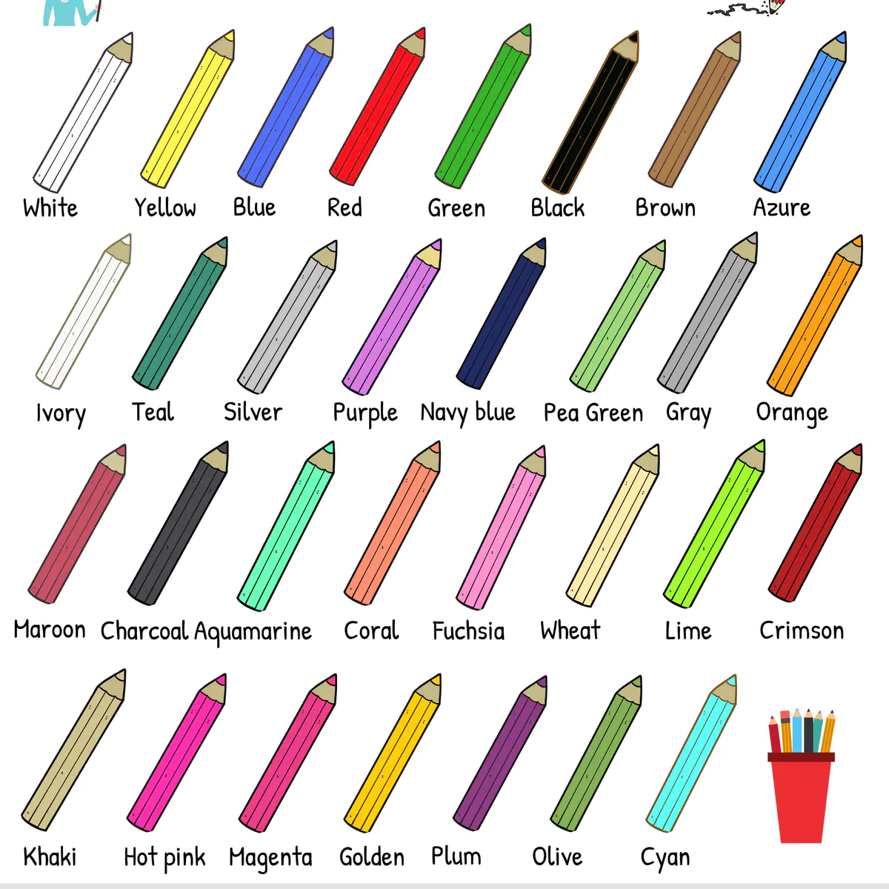

翩翩体，字体大小10

翩翩体，字体大小10

$\color{Purple}{Purple 紫色}$

---

绿色重点标记💪

浅绿色重点标记💪

红色重点标记💪

橙色重点标记💪

浅蓝色重点标记💪

蓝色重点标记💪

浅紫色重点标记💪

紫色重点标记💪

粉色重点标记💪

黄色重点标记💪

红色

深绿色

<table>
    <tr>
        <td bgcolor=#9933CC>
            紫色背景
        </td>
    </tr>
</table> 

<table>
    <tr>
        <td bgcolor=#00CC66>
            绿色背景
        </td>
    </tr>
</table> 

<table>
    <tr>
        <td bgcolor=#339966>
            深绿色背景
        </td>
    </tr>
</table> 

**如果想合并表格，可以加上colspan/rowspan。**
1. 水平单元格的合并：基于colspan属性，即使一个单元格占多列的空间
2. 纵向单元格的合并：基于rowspan属性，即使一个单元格占多行的空间

<table> 
    <tr>
        <th colspan = "3">1</th>
    </tr>
    <tr>
        <td>1</td>
        <td>2</td>
        <td>3</td>
    </tr>
      <tr>
        <td>1</td>
        <td rowspan = "3">2</td>
        <td rowspan = "3">3</td>
    </tr>
      <tr>
        <td>1</td>
    </tr>
       </tr>
      <tr>
        <td>1</td>
    </tr>
<table>

1. 
2. [MarkDown All in one 自动生成目录：consrol + c](#markdown-all-in-one-自动生成目录consrol--c)
3. [control + d](#control--d)
4. [control + s](#control--s)
5. [control + a](#control--a)
6. [CSS](#css)

## MarkDown All in one 自动生成目录：consrol + c

## control + d
2023-01-19

## control + s
21:32:35

## control + a
2023-01-19 21:46:43

## CSS

        
I am centered!

        
I am centered!

        深绿色

---

